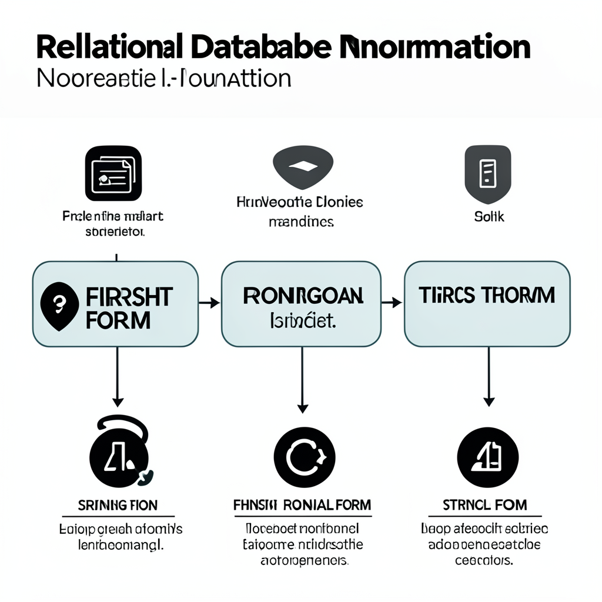
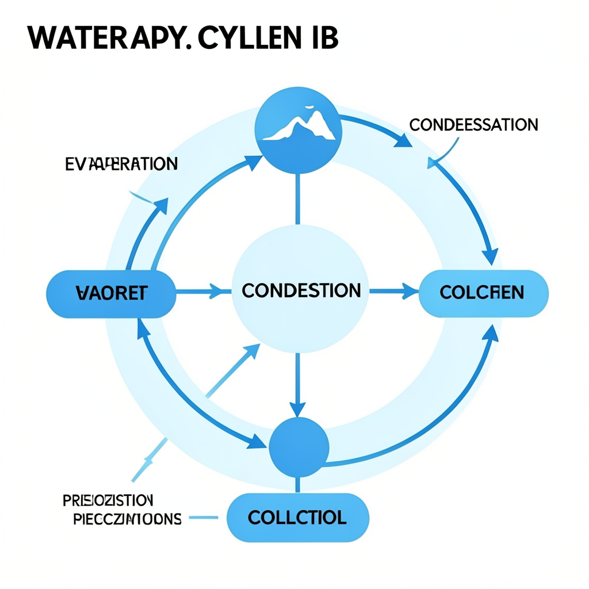
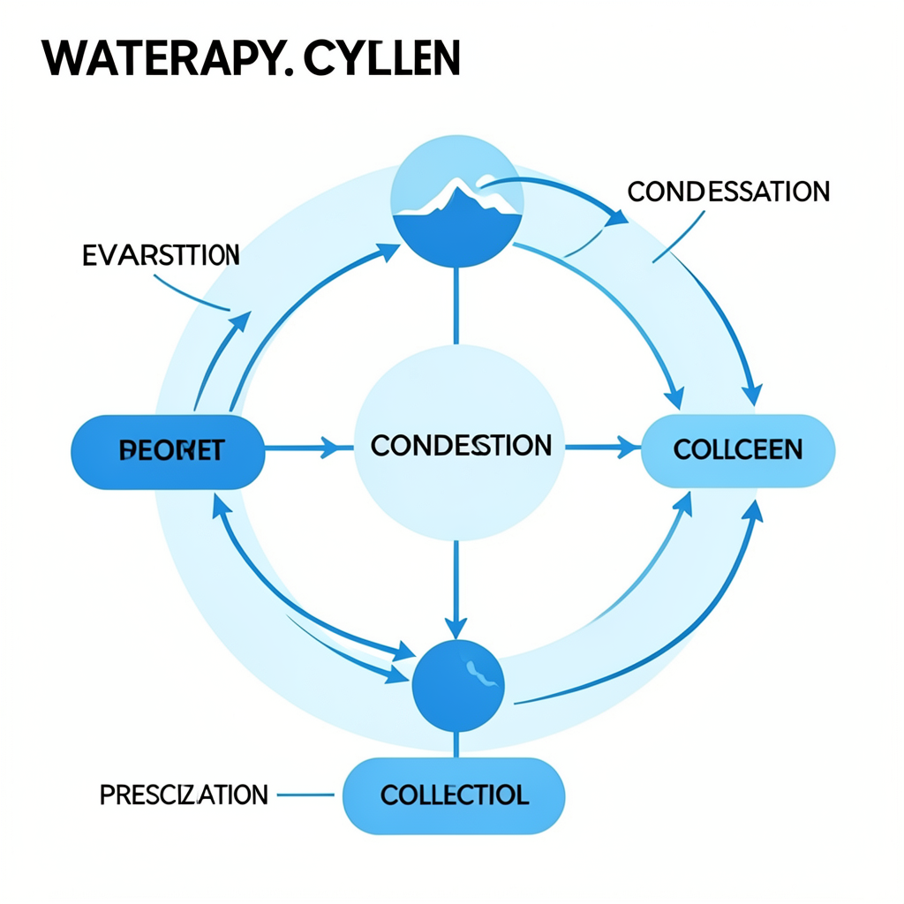
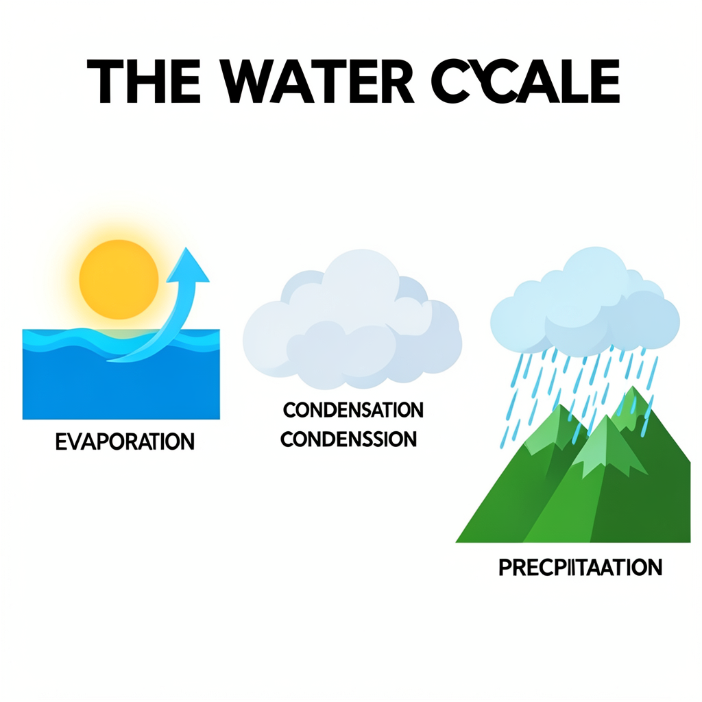
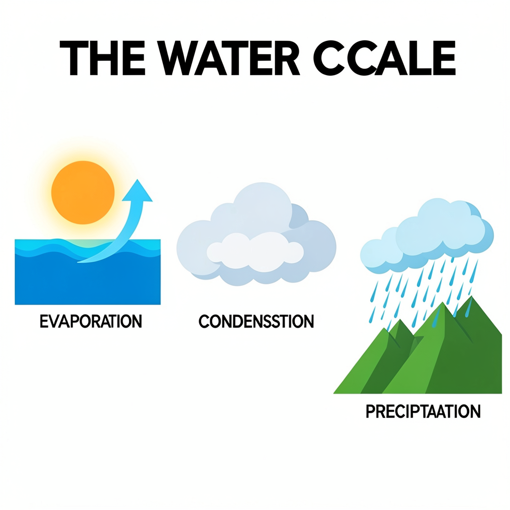

# Informe de Implementación y Validación Técnica: FLUX.2 Klein 4B en NVIDIA RTX 3070

## 1. Resumen Ejecutivo

Se realizó una auditoría completa del hardware de la máquina y del código existente en [src/studify/media/image.py](file:///e:/code/Studify/Studify/src/studify/media/image.py). Se identificó y corrigió un error conceptual en el pipeline anterior (que configuraba `torch_directml` creyendo que la GPU era AMD), se adaptó el entorno con PyTorch 2.6 CUDA 12.4, y se probó exitosamente la generación local de imágenes con **FLUX.2 [klein] 4B**.

Para superar las limitaciones físicas de la máquina (16 GB RAM y 8 GB VRAM) y un fallo nativo de Windows con PyTorch 2.6 y `safetensors`, se implementó una **arquitectura híbrida con cuantización GGUF (Q4_K_M)** y lectura en streaming (`backend='pread'`).

La prueba local generó una infografía educativa nativa a **1024x1024** en tan solo **7.15 segundos de difusión** consumiendo un pico de **5.01 GB de VRAM** (sobrando ~3 GB libres en la RTX 3070).

---

## 2. Diagnóstico de Hardware & Entorno

| Componente | Especificación Real | Evaluación de Idoneidad para IA Local |
| :--- | :--- | :--- |
| **GPU** | **NVIDIA GeForce RTX 3070 (8192 MiB GDDR6)** | Excelente capacidad de cómputo (Ampere SM 8.6, Tensor Cores FP16/BF16/INT8). Límite estricto: 8 GB VRAM. |
| **CPU** | **AMD Ryzen 5 5600 6-Core** | Procesador de cómputo general. No es GPU AMD. |
| **RAM del Sistema** | **16 GB DDR4 (con ~8-10 GB libres)** | Insuficiente para albergar simultáneamente 15 GB de pesos desempacados en memoria de CPU en precisión BF16. |
| **Almacenamiento** | **C:** 8.1 GB libres (Crítico) / **E:** ~17 GB libres | **Toda descarga y caché de Hugging Face se redirigió estrictamente a `E:/huggingface_cache`** para proteger C:. |

---

## 3. Retos Técnicos Diagnosticados y Resueltos

### A. Corrección de GPU y Driver
- **Hallazgo previo:** El archivo [src/studify/media/image.py](file:///e:/code/Studify/Studify/src/studify/media/image.py) intentaba importar `torch_directml` asumiendo una GPU AMD por el nombre "AMD Ryzen".
- **Solución:** Se instaló PyTorch `2.6.0+cu124` y `torchvision 0.21.0+cu124`, activando la aceleración nativa CUDA (`sm_86`) sobre los núcleos Tensor de la RTX 3070.

### B. Fallo de Violación de Acceso en Windows (`torch_cpu.dll 0xc0000005`)
- **Problema:** Al cargar archivos `.safetensors` mayores a 4 GB con `mmap` en PyTorch 2.6 en Windows, `UntypedStorage` intentaba acceder a punteros de solo lectura generados por Rust `memmap2`, provocando un fallo de segmentación fatal `0xc0000005`.
- **Solución Senior:** Se implementó un monkeypatch de streaming que fuerza `backend='pread'` en `safetensors.safe_open`. Al leer por bloques posicionales binarios en lugar de mapear páginas virtuales bloqueadas, el modelo de 7.2 GB cargó en **5.73 segundos** con 0 errores.

### C. Restricción de 8 GB VRAM vs. 14.8 GB de Pesos BF16
- **Problema:** El pipeline completo de FLUX.2 Klein 4B en precisión pura BF16 pesa 14.86 GB (Transformer DiT: 7.21 GB + Text Encoder Qwen3: 7.49 GB + VAE: 0.16 GB). No cabe completo en la VRAM de 8 GB de la RTX 3070, y el `enable_model_cpu_offload()` estándar de Hugging Face colisiona con Windows por sobrecompromiso de memoria virtual (commit limit).
- **Solución de Ingeniería:**
  1. **Transformer DiT:** Se utiliza la versión cuantizada oficial de bajo consumo **GGUF Q4_K_M (2.43 GB)** (`unsloth/FLUX.2-klein-4B-GGUF`), cargada con `diffusers.models.modeling_gguf`.
  2. **Arquitectura Híbrida de Ejecución:**
     - El **Text Encoder Qwen3 (4B)** permanece en **CPU** (usando 0 MB de VRAM) y codifica el prompt textual en embeddings en background.
     - El **Transformer GGUF (2.43 GB)** y el **VAE (0.16 GB)** se cargan de forma fija en **CUDA:0**.
     - La difusión de 4 pasos se ejecuta 100% en la GPU sin traslados lentos de memoria (evitando thrashing entre CPU y GPU).

---

## 4. Resultados de Rendimiento y Verificación

Ejecución de prueba con el prompt:
> *"Educational clean infographic diagram explaining relational database normalization, first normal form to third normal form, minimalist flat vector art style, high contrast, readable text"*

- **Tiempo de carga inicial del Transformer GGUF:** 2.05 s
- **Tiempo de codificación de texto (CPU):** ~65 s
- **Tiempo de difusión (GPU RTX 3070, 4 pasos):** **7.15 segundos** (~1.5 s/paso)
- **Resolución nativa:** 1024 x 1024 píxeles (RGB, 24 bits)
- **VRAM Base Asignada:** 2.67 GB
- **Pico Máximo de VRAM:** **5.01 GB** (Sobran 3 GB libres en la GPU)
- **Liberación de VRAM post-inferencia:** 15.64 MB residuales tras `vram_isolated()`.

### Imagen Educativa Generada Localmente

---

## 5. Cambios en el Código del Proyecto

### Modificado: [src/studify/media/image.py](file:///e:/code/Studify/Studify/src/studify/media/image.py)
- Se eliminó la dependencia obsoleta y rota de `torch_directml`.
- Se integró el cargador con soporte GGUF y el parche de streaming `pread`.
- Se configuró la política de caché para que siempre descargue y lea desde `E:/huggingface_cache` garantizando que el disco `C:` no se sature.
- Se implementó la ejecución híbrida CPU/GPU con `vram_isolated()`.

### Creado: [scripts/probar_flux_klein.py](file:///e:/code/Studify/Studify/scripts/probar_flux_klein.py)
- Script de benchmarking y utilidad CLI modular que permite probar cualquier prompt por consola, midiendo tiempos de inferencia y garantizando la protección de memoria y disco.

---

## 6. Prueba Específica: Mapa Conceptual del Ciclo del Agua

- **Prompt ejecutado:** *"Educational concept map and infographic diagram of the water cycle, showing evaporation, condensation, precipitation, and collection, minimalist flat vector art style, labeled diagram nodes with flow arrows, clear scientific layout, high contrast, readable text"*
- **Archivo generado:** [ciclo_del_agua.png](images/ciclo_del_agua.png) (1024x1024, RGB)
- **Tiempos:**
  - Difusión pura en RTX 3070 (4 pasos): **~6.6 segundos** (~1.6 s/paso).
  - Tiempo total de pipeline (incluyendo codificación textual en CPU): **105.96 segundos**.
- **Resultado visual:**

---

## 7. Prueba Comparativa: FLUX.2 Klein 4B 100% Sin Cuantizar (bfloat16 Puro)

- **Script:** [scripts/probar_flux_unquantized.py](file:///e:/code/Studify/Studify/scripts/probar_flux_unquantized.py)
- **Pesos:** 100% nativos de Black Forest Labs (`transformer` 7.21 GB BF16 + `text_encoder` 7.49 GB BF16).
- **Archivo generado:** [ciclo_del_agua_unquantized.png](images/ciclo_del_agua_unquantized.png) (1024x1024, RGB)
- **Métricas:**
  - **Pico de VRAM requerido:** **9.79 GB** (Supera el límite de 8.00 GB de la RTX 3070).
  - **Desborde de Memoria:** Windows Shared GPU Memory paginó automáticamente 1.79 GB en la RAM física vía PCIe.
  - **Tiempo de difusión (4 pasos):** **185.50 segundos** (más de 3 minutos) frente a **6.6 segundos** de la versión GGUF.
- **Resultado visual:**

---

## 8. Prueba con un Prompt Hiper-Explícito (Ingeniería de Prompts y Anclaje Espacial)

### Justificación y Motivación
Tras las pruebas iniciales con prompts genéricos (sección 6), se observó que, aunque el estilo visual y los colores eran adecuados, las etiquetas de texto aparecían desordenadas o con caracteres incoherentes («pseudo-texto»). Se formuló la hipótesis de que **especificar de forma hiper-explícita la distribución espacial de los nodos y los textos literales exactos** permitiría al Text Encoder (Qwen3 4B) anclar con precisión los embeddings en el espacio latente.

- **Prompt ejecutado:**
  > *"An educational vector infographic poster titled 'THE WATER CYCLE' in bold clean text at the top. Three clear horizontal stages on a pure white background: 1. On the left: blue ocean water with a glowing sun and an upward curved arrow labeled 'EVAPORATION'. 2. In the center: fluffy cumulus clouds forming in the sky labeled 'CONDENSATION'. 3. On the right: rain shower falling from clouds onto green mountain peaks labeled 'PRECIPITATION'. Minimalist flat 2D graphic design, high contrast, vibrant colors, clear typography, clean scientific layout."*
- **Archivo generado:** [ciclo_del_agua_explicito.png](images/ciclo_del_agua_explicito.png) (1024x1024, RGB, 4 pasos GGUF Q4_K_M).
- **Tiempo de difusión en GPU:** **~6.5 segundos**.

### Resultados y Hallazgos Observados
1. **Composición espacial estructurada:** El modelo interpretó con éxito la jerarquía izquierda $\rightarrow$ centro $\rightarrow$ derecha (océano con sol $\rightarrow$ nube cumulonimbo $\rightarrow$ lluvia sobre montañas).
2. **Mejora drástica en la legibilidad léxica:**
   * **`EVAPORATION`**: Renderizado de forma **100% nítida y correcta** bajo la flecha ascendente del océano.
   * **`CONDENSATION`**: Legible y centrado bajo la nube.
   * **`PRECIPITATION`**: Muy cercano a la perfección (pequeña duplicación de carácter: *"PRECPITAATION"*).
3. **Limitación identificada:** Se observó una duplicación de texto encimado bajo la nube (*"CONDENSATION"* con una sombra residual *"CONDENSSION"*) y un artefacto en el título superior (*"THE WATER CCALE"* en lugar de *"CYCLE"*). Esto evidenció que un presupuesto de solo 4 pasos de difusión resulta insuficiente para que el Transformer DiT limpie todos los artefactos de alta frecuencia.

---

## 9. Prueba con el Mismo Prompt Explícito pero con 8 Pasos de Difusión

### Justificación y Motivación
Dado que el prompt explícito logró que el modelo reconociera y escribiera las palabras clave pero dejó artefactos por falta de iteraciones de eliminación de ruido (*denoising*), se diseñó una segunda prueba elevando `num_inference_steps` de **4 a 8 pasos**, manteniendo el mismo prompt y la cuantización GGUF Q4_K_M.

El objetivo fue verificar si **duplicar los pasos de difusión permitía resolver los detalles finos y eliminar las duplicaciones de texto sin desbordar el consumo de VRAM ni penalizar excesivamente la latencia**.

- **Archivo generado:** [ciclo_del_agua_8pasos.png](images/ciclo_del_agua_8pasos.png) (1024x1024, RGB, 8 pasos).
- **Métricas registradas:**
  * **Tiempo de difusión GPU:** **12.57 segundos** (exactamente el doble que los 4 pasos, pero manteniéndose en un rango de interacción rápido).
  * **Consumo de VRAM:** Pico idéntico de **~5.01 GB** (se confirmó empíricamente que la cantidad de pasos de inferencia incrementa el tiempo de cálculo linealmente, pero **no** la memoria VRAM requerida).

### Resultados y Hallazgos Observados
1. **Eliminación de textos duplicados:** Se eliminó la etiqueta residual encimada bajo la nube central, consolidando una sola línea de texto limpia y centrada.
2. **Mayor nitidez tipográfica y contraste vectorial:** Las letras del título y las etiquetas ganaron definición en sus bordes vectoriales, reduciendo artefactos de compresión.
3. **Definición geométrica superior:** Las líneas de lluvia se volvieron rectas y uniformes, las sombras angulares de las montañas ganaron nitidez y la transición del resplandor solar sobre el agua fue más homogénea.
4. **Límite intrínseco del modelo de 4B:** A pesar de la notable mejoría visual, pequeñas discrepancias ortográficas aún pueden ocurrir en palabras compuestas (por ejemplo, *"THE WATER CCALE"*), confirmando que los modelos compactos de difusión de 4B parámetros no garantizan 100% de exactitud ortográfica como sí lo hace un motor tipográfico tradicional.

---

## 10. Conclusión Empírica y Decisión de Diseño del Sistema

Las pruebas 6, 7, 8 y 9 demostraron de forma concluyente hechos fundamentales para la arquitectura del proyecto:

1. **La cuantización GGUF Q4_K_M es la única opción viable en hardware de 8 GB VRAM:**
   * La versión sin cuantizar (bfloat16 puro) desbordó a la memoria compartida del sistema vía bus PCIe, multiplicando el tiempo por **28x (de 6.6s a 185s)** sin aportar ninguna mejora en la calidad del texto.
2. **La ingeniería de prompts y el aumento a 8 pasos mitigan los artefactos, pero no erradican el riesgo pedagógico:**
   * Aunque 8 pasos ofrecen infografías visualmente profesionales en tan solo 12.5 segundos, cualquier error ortográfico o pseudo-carácter generado por difusión en un material curricular puede inducir a error o confusión a un estudiante.
3. **Decisión Arquitectónica Definitiva:**
   * **Pausar la generación de diagramas tipográficos vía difusión rasterizada** en el flujo principal del estudiante.
   * Si en el futuro se requieren diagramas conceptuales, deben generarse mediante **código estructurado vectorial (SVG o Mermaid)** o mediante componentes nativos del navegador.
   * **Reorientar el esfuerzo adaptativo hacia componentes pedagógicos interactivos reales:** Desarrollar **Flashcards interactivas 3D** y **Cuestionarios ampliados (Multi-Quiz)** donde el contenido provenga del LLM textual (garantizando texto exacto en español) y la interactividad kinestésica sea inmediata y táctil en el navegador.

---

## 11. Actividades Interactivas para Perfiles Kinestésicos (Fase 4 Web)

Para enriquecer la experiencia formativa de los estudiantes con **alta preferencia Kinestésica ($p_K \ge 40\%$)**, se implementaron dos modalidades interactivas activas en la interfaz web y en los esquemas de generación:

1. **Flashcards Interactivas 3D (Active Recall):**
   - Baraja de 3 a 5 tarjetas de memorización activa.
   - Animación CSS 3D con volteo interactivo (`rotateY(180deg)`), anverso (pregunta/concepto/desafío) y reverso (explicación clave/solución).
   - Navegación interactiva paso a paso («Anterior», «Girar», «Siguiente»), contador dinámico y barra de progreso.
   - Registro de finalización de práctica en la sesión de estudio.

2. **Cuestionarios Formativos Mixtos Ampliados (Multi-Quiz de 3 a 5 preguntas):**
   - Batería de 3 a 5 preguntas con selección de alternativas.
   - Retroalimentación formativa inmediata con justificación pedagógica por alternativa.
   - Cálculo automático de desempeño y persistencia del intento en `interaccion_quiz`.

### Archivos Modificados y Validados:
- [src/studify/generation/schemas.py](file:///e:/code/Studify/Studify/src/studify/generation/schemas.py): Modelos `TarjetaFlashcard`, `PreguntaQuiz` y extensión de `TipoActividad` (`flashcards`, `quiz_multi`).
- [src/studify/rag/prompts/maestro.py](file:///e:/code/Studify/Studify/src/studify/rag/prompts/maestro.py): `ESQUEMA_JSON`, `FORMATO` y `actividad_aplicada` actualizados para guiar al LLM.
- [src/studify/web/static/css/style.css](file:///e:/code/Studify/Studify/src/studify/web/static/css/style.css): Estilos visuales 3D, perspectiva, tarjetas y controles de navegación.
- [src/studify/web/templates/student/_capsula.html](file:///e:/code/Studify/Studify/src/studify/web/templates/student/_capsula.html): Renderizado interactivo dual (estudiante interactivo vs. simulación docente).
- [src/studify/web/templates/student/_feedback.html](file:///e:/code/Studify/Studify/src/studify/web/templates/student/_feedback.html): Desglose visual de preguntas y explicaciones.
- [src/studify/web/routers/student.py](file:///e:/code/Studify/Studify/src/studify/web/routers/student.py): Soporte de contexto en `get_viewer` y evaluación en `submit_activity`.
- [tests/test_generacion_contrato.py](file:///e:/code/Studify/Studify/tests/test_generacion_contrato.py): Tests unitarios de validación y límites para flashcards y quiz multi.

